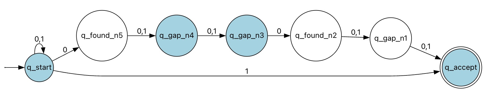

# NFA 0's near end or 1 at end

## Problem Description
**Task:** Write a nondeterministic finite automaton (NFA) with **at most 10 states** that decides whether its input is contained in the following set:

$$
\{ x \in \{0, 1\}^* \mid x[|x| - 5] = x[|x| - 2] = 0 \text{ or } x[|x|] = 1 \}
$$

### Notation Note
We index strings starting at 1, so:
* $x[1]$ is the first symbol.
* $x[|x|]$ is the last symbol.

### Formatting & Submission
* **Simulator:** Format the automaton to be used with the simulator here: [http://web.cs.ucdavis.edu/~doty/automata/](http://web.cs.ucdavis.edu/~doty/automata/)
* **Filename:** Your submission filename must end with the extension `.nfa`.

## Code Instructions
See `q1.nfa` for the code. The simulation process is shown as follows.
