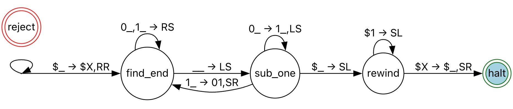

# TM Binary to Unary Conversion

## Problem Description
**Task:** Write a Turing machine that converts its input from binary to unary. 

In other words, if the input is the string $x \in \{\$,0,1\}^*$, a `$` followed by the binary expansion of the nonnegative integer $n$ (for example, `$101` to represent $n=5$), then the machine outputs the string $1^n$ (n ones). 

You may assume the input string will be in this format, i.e., a `$` followed by either just a `0`, or followed by a binary string beginning with `1`.

**Format:** Format the Turing machine to be used with the simulator here: [http://web.cs.ucdavis.edu/~doty/automata/](http://web.cs.ucdavis.edu/~doty/automata/). 

Click the Help link at the top of the page for instructions explaining how Turing machines process input and output in the simulator, and how to specify multi-tape Turing machines. Either a single-tape or a multiple-tape Turing machine may be used. Your submission filename must end with the extension `.tm`.

## Code Instructions

See `binary2unary.tm` for the code. We use two tapes to solve the problem. The simulation process is shown as follows.

